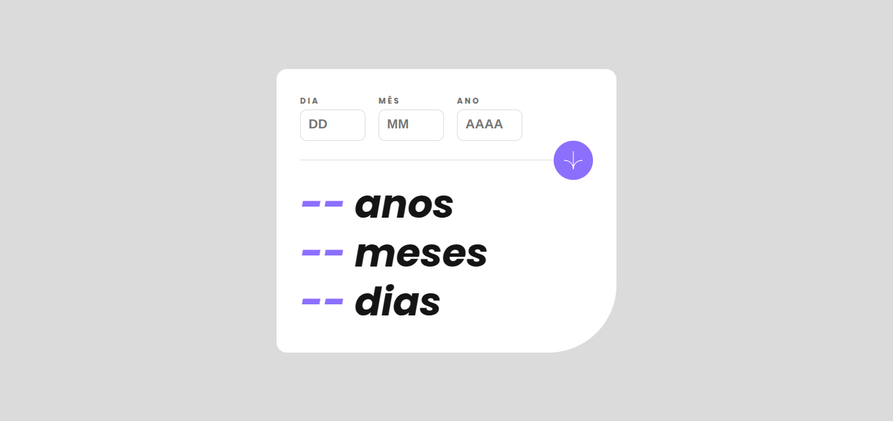

# Frontend Mentor - Age calculator app ⏰

<h3 align="justify">Desafio do site <a href="https://www.frontendmentor.io/">Frontend Mentor</a>. Projeto desenvolvido com o objetivo de praticar e consolidar conhecimentos.</h3>

 

  

## Tópicos

- [Imagem do projeto](#img)
- [Acesso ao projeto](#acesso)
- [Descrição do projeto](#desc)
- [Funcionalidades do projeto](#func)
- [Tecnologias utilizadas](#tec)
- [Status do projeto](#status)
- [Desenvolvedor do projeto](#dev)
- [Licença](#license)

 

<h2 id="img">🖥️ Imagem do projeto</h2>

    

 

<h2 id="acesso">⚓ Acesso ao projeto</h2>

Acesse o projeto clicando [aqui](https://fel1324.github.io/AgeCalculatorApp/)

 

<h2 id="desc">💻 Descrição do projeto</h2>

  O projeto é uma calculadora de idade.

 

<h2 id="func">⚙️ Funcionalidades do projeto</h2>

<ul>
  <li>Calcula e exibe quantos anos o usuário possui, com base na data informada.</li>
  <li>Calcula e exibe quantos meses o usuário possui.</li>
  <li>Calcula e exibe quantos dias o usuário possui.</li>
</ul>

 

<h2 id="tec">🛠️ Tecnologias utilizadas</h2>

* HTML
* CSS
* JavaScript
* Git e Github

 

<h2 id="status">🚧 Status do projeto</h2>

✔️ Projeto Finalizado

 

<h2 id="dev">👨‍💻 Desenvolvedor do projeto</h2>

* Rafael Roberto de Oliveira

 

<h2 id="license">📝 Licença</h2>

Esse projeto está sob a licença MIT.